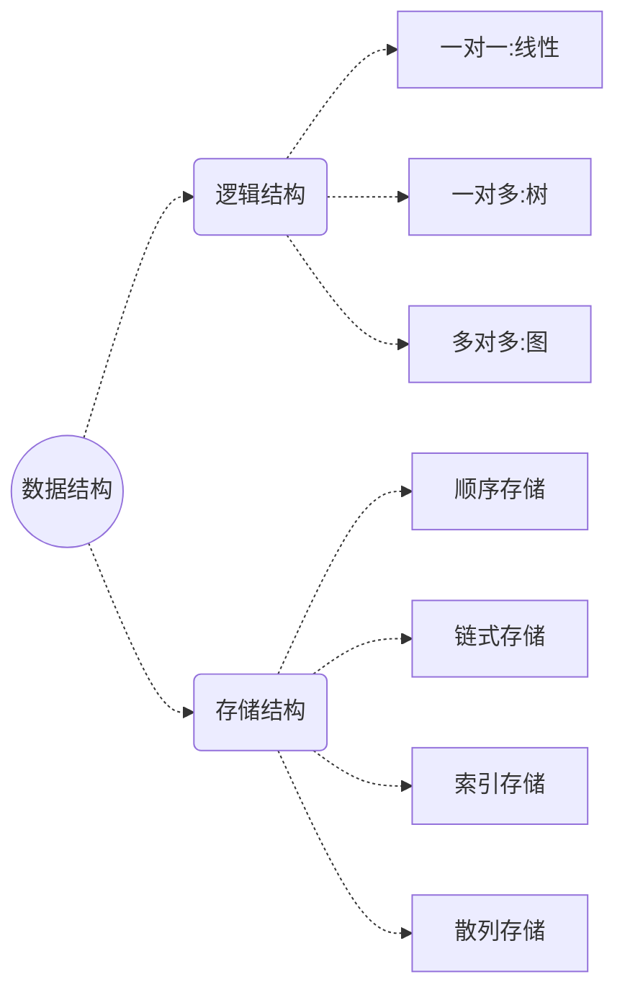
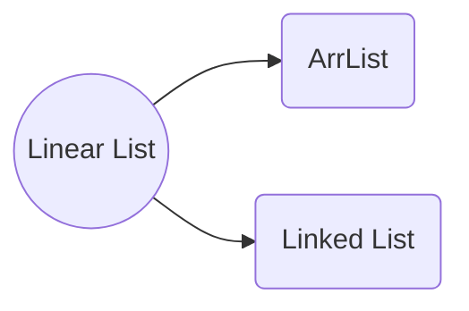

# 一 绪论

## 1.1 数据结构 Data Structure

定义：数据对象在计算机中的组织方式；



## 1.2 抽象数据类型 Abstract Data Type, ADT

- 数据类型：
  - 对象集：静态属性；
  - 操作集：动态行为、方法、函数；
- 抽象：只关心数据类型是什么，而**不关心是怎么实现的**；抽象描述与算法与编程语言无关。

------

==**例 1.1**== 矩阵Matrix的抽象数据类型描述

类型名称： 矩阵 Matrix

对象集：								$A_{M\times N}= \begin{pmatrix}  a_{11} & a_{12}  & \cdots & a_{1N} \\a_{21} & a_{22}  & \cdots & a_{2N} \\ \vdots & \vdots  & \ & \vdots \\a_{M1} & a_{M2}  & \cdots & a_{1N} \\\\  \end{pmatrix}  &  $

操作集(自然语言描述)：

```cpp
    //初始化一个元素M行N列的零矩阵
    //求矩阵A的行数；
	//求矩阵A的列数；
	//获取i行j列的元素；
	//给矩阵赋值；
	//利用矩阵A和B的相加得到"和矩阵"对象
	//  ......
```

------

## 1.3 抽象数据类型的C++语言声明与实现

------

==**例 1.2**== 使用C++的**类模板**声明例1.1的矩阵类

```cpp
//eg1_2.cpp (part1:声明部分)
#include<iostream>
using namespace std;
template <class EleType>
class Matrix {
    private: 			//一般将对象集封装成私有的静态属性，不对外提供访问
    	int M;			//行数
    	int N;			//列数
    	EleType **arr;  //使用二维指针来存放矩阵的元素；
    public:
        Matrix(int M, int N);			//初始化一个元素M行N列的零矩阵
    	int getM(); 					//求矩阵A的行数；
    	int getN();						//求矩阵A的列数；
    	EleType getEle(int i,int j);	//获取i行j列的元素；
    	Matrix(Matrix<EleType>A,Matrix<EleType>B);
            							//利用矩阵A和B的相加得到"和矩阵"对象
    	void setMatrix(EleType **ar);	//给矩阵赋值；
};
```

------

上述例子中，只是抽象的描述了以下成员函数，并未具体实现；若要完整的声明一个具体类还需要编写具体的成员函数体；这将涉及重要的部分：算法。

下列给出我初步学习写得函数实现算法！**尚未考虑算法复杂情况**

------

==**例 1.3**== 俺滴矩阵类实现方法部分（接例1.1~1.2）

```cpp
template <class EleType>
int Matrix <EleType>::getN(){
    return N;
}
template <class EleType>
int Matrix <EleType>::getM(){
    return M;
}

template <class EleType>
Matrix <EleType>:: Matrix(const int M ,const int N){
    this->M = M;
    this->N = N;
    EleType **a =  new EleType *[N];
    for (int  i = 0; i< M; i++){
        a[i] =  new EleType[M];
    }
    for (int i  =0 ; i < M ; i ++)
        for(int j = 0; j < N ; j++)
         a[i][j] =0;
    arr = a;
}

template<class EleType>
EleType Matrix <EleType>:: getEle(int i,int j){
    return arr[i-1][j-1];
}

template<class EleType>
Matrix<EleType>:: Matrix (Matrix<EleType> A, Matrix<EleType> B) {
    this->M =  A.M;
    this->N =  B.N;
    EleType **a =  new EleType *[N];
    for (int  i = 0; i< M; i++){
        a[i] =  new EleType[M];
    }
    
    for (int i  =0 ; i < M ; i ++)      
        for(int j = 0; j < N ; j++)
         a[i][j] = A.arr[i][j]+ B.arr[i][j];
          
    this->arr = a;
}

template <class EleType>
void Matrix<EleType>::setMatrix(EleType **a ){
    this->arr = a;
    }
```

------

## 1.4 算法与算法分析

### 1.4.1 算法

- 步骤必须优先，不能是死循环；
- 能够被实现；
- 能够被自然语言抽象的表述出来，不依赖于某一特定的编程语言；


什么是好算法？算法执行过程中会消耗**时间成本**和**空间成本**，引入两个指标来衡量算法的好坏：

- 空间复杂度$S(n)$；

- 时间复杂度$T(n)$；

  *其中 $n$ 是数据规模*

### 1.4.2 算法分析

------

==例1.4== 空间复杂度分析：打印 $1\to n $ 的数

- **算法1**  循环打印

  ```cpp
  void printN(int n){
  	for (int i =1 ; i< n+1; i++)
  		cout<<i<<endl;
  }
  ```

  **分析**  整个过程只用到一个临时变量 $i$ ，所以 $S(n)=c$，大$O$渐进表示为：$O(S(n))=O(c)=1$

- **算法2**  递归打印

  ```cpp
  void printN(int n){
  	if(n>0){
  		printN(n-1);
  		cout<<n<<endl;
  	}
  }
  ```

  **分析**  $printN(k)$ 的调用必须在 $printN(k-1)$ 调用完成后才能完成；所以 $1 \to n $ 的过程中每次都需要空间 $c$ 去记录 $printN(k-1)$ 的调用完成状态。所以 $S(n)=c n$，大$O$渐进表示为：$O(S(n))=O(cn)=n$


**综上所述**  对于空间复杂度来说，循环算法优于递归算法。

------


------

==例1.5== 时间复杂度分析

​	计算多项式
$$
f(x)=a_0+a_1x+\ldots+a_nx^n
$$
​	在 $x$ 处的值。

- **算法1** 笨办法求解

  ```cpp
  double calculate(double x, double a[], int n){
  	double p = a[0];
      for(int i  = 1; i< n+1 ;i++){
          p += a[i]*pow(x,i);
      }
      return p;
  }
  ```

  **分析**  注意到在 $for$ 的第 $i$ 次循环中 $p+=a_i*x^i$ 需要进行 $i+1$ 次乘法计算（$k$次方认为进行了$k$次乘法计算），所以总时间复杂度为：$T(n)=c(1+2+\ldots+n)=\frac{cn(n+1)}{2}$，大$O$渐进表示为：$O(T(n))=n^2$

- **算法2** 秦九韶算法         //为华教过 (#^.^#)
  $$
  f(x)= 
   &a_0+x\{a_1+x[\ldots+xa_n]\}\\
  $$

  ```cpp
  double calculate(double x,double a[], int n){
  	double p=a[n];
      for(int i=n;i>0;i--){
          p += a[i-1]+p*x;
      }
      return p;
  }
  ```

  **分析**  每次循环中都只进行了一次乘法和一次加法，所以：$T(n)=cn$；大$O$渐进表示为：$O(T(n))=n$

**综上所述**  对于时间复杂度来讲，秦九韶算法优于普通的幂项累加求法

------


# 二 线性表 linear list

## 2.1 概念

​	二元组 $B=(K,R)$ 表示线性表：
$$
K=\{k_0,k_1,···,k_{n-1}\}\\
R=\{r\}
$$

​	$K$是结点集合，$k_i$是结点，$R$是关系集合，这里关系$r$表示线性关系；

​	**线性表的所有结点可以按照线性关系 $r$ 排列成一个线性序列，结点 $k_i$ 是结点 $k_{i+1}$ 的前驱，结点 $k_{i+1}$ 是结点 $k_i$ 的后继。**


### 2.1.1 线性表的抽象数据类型

------

==例2.1== 线性表的抽象数据类型（伪代码）

```cpp
template <class EleType>
class List {
    private:
    	/*	线性表的元素个数  */
   		/*	元素位置信息pos	*/
    	/*	线性表元素集values*/
    	/*  其它				*/
    public:
		/*  线性表的"增""删""改""查"等操作
			CURD:
				create  增	如：insert(pos,value);
				update  改	如：update(pos,value);
				retrieve查	如：selectByPos(pos); selectByValue(value);
				delete	删	如：deleteByPos(pos);
			,etc   */
}
```

------


线性表抽象数据类型并不是唯一的，有些应用中，对于未知信息的获取非常重要！如：JDBC里的resultSet对象；

那么就该应用这些函数：

```cpp
		bool setPos(int pos);   // 设置当前下标
		int markPos();			// 记录当前下标
		bool toStart();			// 下标移到表头
		bool toEnd();			// 下标移到表尾
		bool prev();			// 下标前移一位  若没有前一位返回false
		bool next();			// 下标后移一位  若没有下一位返回false
```

这种线性表的遍历可以通过以下伪代码来实现：

```cpp
		List <type> myList; //创建List对象，type是具体的参数类型，是EleType的实现
		while (myList.next()){  //将实现对线性表的遍历
		    /****doSomething****/
		}
```


### 2.1.2 线性表的存储结构

​	根据存储结构不同分为两大类

- **顺序表**： ==定长==的顺序存储结构，==通过创建数组array来建立这种存储结构==；线性表中的元素==物理地址相邻==，线性表的==长度是固定的，不能变化==；
- **链    表**： ==变长==的链式存储结构，使用==指针==来表示元素之间的线性关系。




## 2.2 顺序表  array-based list, AKA: vector

​	顺序表中的每个元素有唯一的索引值( $index$ , 下标)，$index$从$0$起到$(n-1)$；

​	结点集$K=\{k_i\} ;i=0,1,2,…,(n-1)$

|     表内元素（结点）      | $k_0$ | $k_1$ | $k_2$  | $\ldots$ | $k_{n-1}$  |
| :-----------------------: | :---: | :---: | :----: | :------: | :--------: |
| **逻辑地址（下标index）** |  $0$  |  $1$  |  $2$   | $\ldots$ |   $n-1$    |
| **存储地址（物理地址）**  |  $b$  | $b+L$ | $b+2L$ | $\ldots$ | $b+(n-1)L$ |

*$b$是首个元素 $k_0$ 的物理地址(AKA:基地址)，$L$是每个元素所占的存储空间大小，由于物理地址相邻的特性，所以有以上逻辑关系。*
$$
\begin{array}{c|ccccc}\hline \text{表内元素（结点）} & k_0 &k_1&k_2 & \ldots & k_{n-1} \\
\hline \text{逻辑地址（} index \text{）} &0 & 1 & 2 & \ldots & n-1\\
\hline \text{存储地址（物理地址）}& b & b+L & b+2L & \ldots & b+(n-1)L \\ 
\hline
\end{array}
$$


### 2.2.1 顺序表的类定义

```cpp
//eg2_2.cpp  (part1：类定义部分)
#include<iostream>
#include"eg2_1.cpp"  //这里面是ArrList继承的List的代码，与cpp文件放在同一个文件夹内   
template <class T>
class ArrList : public List <T> {  //声明类模板，顺序表arrList继承了线性表List
	private:
		T *aList;
		int maxSize;				 				//规定此对象的存储空间
		int curLen;									//当前长度
		int position;								//当前位置
	public:
		ArrList(const int size){					//构造含树，
			maxSize = size;
			aList = new T[maxSize];						
			curLen = position = 0;				
		}
		~ArrList(){									//析构含树，清理实例
			delete [] aList;
		}
		void clear(){								//重置表truncate
			delete [] aList;
			curLen = position = 0;
			aList = new T [maxSize];    			//与数据库的truncate操作原理相同
		}
		/********* ↓ 待实现的成员含树 ↓ *********/
		int length();								//返回当前实际长度；
		bool append(const T value);					//表末添加一个元素
		bool insert(const int p ,const T value);	//插入
		bool delete(const int p);					//删除
		bool setValue(const int p , const T value); //赋值
		bool getValue(const int p, T &value);		//取值
		bool getPos(int & p, const T value);		//取下标
		/********* ↑ 待实现的成员含树 ↑ *********/
		
}
```


### 2.2.2 顺序表的运算实现 (实现里面待实现的成员含树)

​	这里就是涉及到算法啦！ 加油呀 (#^.^#) 

```cpp
//eg2_2.cpp  (part2: 成员函数实现部分，显式)
//length
template <class T>
int ArrList <T> :: length(){
    return curLen;
}
//append
template <class T>
bool ArrList<T> :: append(const T value ){
    if (curLen< maxSize){
        aList[curLen] = value;
        curLen ++ ;								//append一个元素curLen就加1
        return true;
    }
    return false;
}
//setValue
template <class T>
bool ArrList <T> :: setValue(const int p, T value )
{	if (p>=0 && curLen > p){
		aList[p] =  value;
		return true ; 
	}
	return false;
}
//getValue
template <class T>
bool ArrList <T> :: getValue(const int p, T &value){
    if (0<= p && curLen > p ){
        value = aList[p];
        return true;
    }
    return false;
}
//insert
template <class T>
bool ArrList <T> :: insert(const int p ,const T value){
	if (curLen < maxSize && p>=0 && p< curLen){
		curLen ++ ; 
		for (int j = curLen - 1 ; j> p ; j--)
			aList[j] = aList[j -1];
		aList[p] = value ; 
		return true;
	}
	return false;
}
//deleteByPos
template <class T>
bool ArrList <T> :: deleteByPos(const int p){
	if ( p >= 0 && p < curLen ){
		curLen -- ; 
		for (int j = 0 ; j < curLen - p; j ++ ){
			aList[p+j]=aList[p+j+1];
		}
		return true;
	}
	return false;
}
//getPos
template<class T>
bool ArrList <T>:: getPos(int & p , const T value)
{												//实现算法，考虑复杂度等问题
	for (int i = 0; i < curLen; i++ )
        if (value == aList[i]){
            p = i ;  							//将i送入p的物理地址里
            return true;
        }
    return false;
}
```


### 2.2.3 main函数测试

```cpp
//eg2_2.cpp (part3: main函数测试部分)
int main(){

    ArrList <int> arrList(20); //maxSize=20 分配了20个元素的存储空间
    arrList.append(0);arrList.append(1);arrList.append(2);arrList.append(3);
    arrList.append(4);arrList.append(5);arrList.append(6);arrList.append(7);
    arrList.append(8);arrList.append(9);arrList.append(10);arrList.append(11);

    cout<<"*********************  原始顺序表  ************************"<<endl;
    arrList.showArrList();
    cout<<"长度为："<<arrList.length()<<endl;
    cout<<"**********************************************************"<<endl;
    cout<<endl;

    cout<<"把下标为0的元素置为99:"<<(arrList.setValue(0,99) ? "成功！":"失败！")<<endl;
    cout<<"把下标为15的元素置为99:"<<(arrList.setValue(15,99) ? "成功！":"失败！")<<endl;
    cout<<endl;

    cout<<"******************* 经setValue操作后 **********************"<<endl;
    arrList.showArrList();
    cout<<"长度为："<<arrList.length()<<endl;
    cout<<"**********************************************************"<<endl;
    cout<<endl;

    cout<<"在下标为1的位置插入88"<<(arrList.insert(1,88) ? "成功！":"失败！")<<endl;
    cout<<"在下标为16的位置插入88"<<(arrList.insert(16,88) ? "成功！":"失败！")<<endl;
    cout<<endl;

    cout<<"******************* 再经insert操作后 **********************"<<endl;
    arrList.showArrList();
    cout<<"此时的长度为："<<arrList.length()<<endl;
    cout<<"**********************************************************"<<endl;
    cout<<endl;

    int p = -1  ;
    cout<<"是否含有数值为10的元素："<<(arrList.getPos( p , 10)? "是---":"否---")<<("其下标为(若不存在返回-1)：")<<p<<endl;
    int l = -1;
    cout<<"是否含有数值为123的元素："<<(arrList.getPos( l , 123)? "是---":"否---")<<("其下标为(若不存在返回-1)：")<<l<<endl;
    cout<<endl;


    
    cout<<"删除下标为4的元素："<<(arrList.deleteByPos(4)?" 成功":"失败")<<endl;
    cout<<"删除下标为20的元素："<<(arrList.deleteByPos(20)?" 成功":"失败")<<endl;
    cout<<endl;

    cout<<"******************* 再经delete操作后 **********************"<<endl;
    arrList.showArrList();
    cout<<"此时的长度为："<<arrList.length()<<endl;
    cout<<"**********************************************************"<<endl;
    cout<<endl;
}
```

执行结果：

```shell
*********************  原始顺序表  ************************
arrList: | 0 | 1 | 2 | 3 | 4 | 5 | 6 | 7 | 8 | 9 | 10 | 11 | 
长度为：12
**********************************************************
把下标为0的元素置为99:成功！
把下标为15的元素置为99:失败！
******************* 经setValue操作后 **********************
arrList: | 99 | 1 | 2 | 3 | 4 | 5 | 6 | 7 | 8 | 9 | 10 | 11 | 
长度为：12
**********************************************************
在下标为1的位置插入88成功！
在下标为16的位置插入88失败！
******************* 再经insert操作后 **********************
arrList: | 99 | 88 | 1 | 2 | 3 | 4 | 5 | 6 | 7 | 8 | 9 | 10 | 11 | 
此时的长度为：13
**********************************************************
是否含有数值为10的元素：是---其下标为(若不存在返回-1)：11
是否含有数值为123的元素：否---其下标为(若不存在返回-1)：-1
删除下标为4的元素： 成功
删除下标为20的元素：失败
******************* 再经delete操作后 **********************
arrList: | 99 | 88 | 1 | 2 | 4 | 5 | 6 | 7 | 8 | 9 | 10 | 11 | 
此时的长度为：12
**********************************************************
```


### 2.2.4 注意点：

1. ​	bool getPos(int & p, const T value);的调用问题：
   ​	首先定义一个 int p；
   ​	直接调用 arrList.getPos( p , 123) ;       这里直接以 p 为形参调用函数，函数将实现将位置信息position传入参量p所在的物理地址中！
2.    cout<<  ==(==   语句   ==)==  <<endl ;     这里需要加括号 ==()==！，不然会报错 ！
       例如：  cout<< ( a==1 ? " a等于1": "a不等于1"  )<<endl;


### 2.2.5 总结-顺序表

​	用maxSize固定顺序表的空间大小；

​	在空间内创建一个 aList[] 数组，数组的长度curLen，就是顺序表的元素个数；

​	利用数组的下标来作为顺序表的下标；


## 2.3 链表

单链表、双链表（很少会用到）、循环链表

### 2.3.1 单链表

==**单链表：**==

- **结点类**：`class Node<T>`
  - **数据域**  `T data;`
  - **指针域**  `Node<T> * next;`
  - **结点的构造函数**；
- **链表类**：`class LnkList : public Node<T>`（继承了结点类）
  - **头指针** `Node<T> * head;` 无数据域，指针域指向第一个结点 $node_0$，结点下标从0起！头指针可以认为下标的-1的虚结点；
  - **尾指针** `Node<T> * tail;` 无数据域，指针域指向最后一个结点 $node_{n-1}$ 
  - **链表的成员函数**： 执行对链表的 **增删改查** (AKA: CURD) 操作；


#### 2.3.1 .1 结点Node类定义

```cpp
//LinkedListTest.cpp (part1: 结点类定义部分)
#include <cstddef> //要用到NULL就要导入这个东东
using namespace std;
//单链表的结点类:
template<class T> class Node {
    public : 
        // 数据域
        T data  ; 
        // 指针域 指向下个结点，默认指向空处
        Node * next = NULL;
    public :
        //结点的构造方法
        Node<T>(){}//无参构造
        Node<T>(const T info ){//有参构造，传入保存的数据
            this->data  = info ;
            this->next = NULL ; 
        }
};
```

#### 2.3.1.2 链表LnkList类定义

```cpp
//LinkedListTest.cpp (part2: 链表类定义，待实现)
//单链表类,继承了结点类
template<class T> class LnkList : public Node <T>{

    private : 
        int n=0;  // 链表的元素个数，private供内部调用，不对外开放
        Node<T> * head  ,*tail ;  //头、尾指针
        Node<T> * setPos(const int p){ //返回指向下标为p的结点的指针变量
                Node<T> * node = head;  //新建一个指针node指向头
                int count = -1;		//若p=-1，则会返回 头指针head
                while (count < p ){
                    count++;
                    node = node->next;
                }
                return node;
        }
    public :
        LnkList(int n );  //有参构造链表对象,元素个数为n
        LnkList();        //无参构造链表对象
        bool isEmpty();   //为空？;
        void clear() ;    //清空;
        int length();     //返回长度 n 
        bool append(const T value ); //表尾插入元素value
        bool insert(const int p, const T value ); //在表的第p个元素位置 插入元素value;
        bool deleteByPos(const int p );  // 通过下标信息删除表中元素;
        bool getValue(const int p , T & value ) ; //通过下标信息获取表中元素,存入value的存储空间中;
        bool getPos(int & p , const T value); //查询链表中第一个值为value的位置信息;
        void showLnkList(){ //链表展示
            Node<T> * tempNode = head;
            Node<T> *node = tempNode->next;
        int count =0 ; 
        while (node != NULL){
            T t = node->data; 
            cout<<"id:"<<count<<",  "<<t<<endl;
            node = node->next;
            count++;
        }
        }
};
```

#### 2.3.1.3 链表类的实现

```cpp
//LinkedListTest.cpp (part3: 链表类的实现)
template<class T> LnkList<T>:: LnkList(int n ){
    this->head = new Node<T> ();
    Node<T>* pre =NULL;
    pre =  head;
    Node<T> *p = new Node<T>();
    for (int i = 0 ; i < n ; i++){
        pre->next = p ;     //在第一次循环时,将使得 head的指针指向第一个结点
        pre = p;
        p->next = NULL;
        this->n++;
    }
    tail->next = p;        //尾指针指向最后一个结点 
}

template<class T> LnkList<T> :: LnkList(){
    this->head = new Node<T>();
    this->tail = new Node<T>();
    tail->next = this->head;
    //空表的时候 tail指向 *head (0结点)
}

template<class T>bool LnkList<T> ::isEmpty(){
    Node<T> *tempNode = NULL;
    tempNode = head->next;
    if (tempNode !=NULL) return false;
    else return true;
}

template<class T>void LnkList<T> ::clear() { 

    Node<T> * node = head->next;
    if (node !=NULL){
        Node<T> * temp = node;
        node = node->next;
        delete temp;
    }
    head->next = NULL;
    tail->next = head;
    this->n = 0;

}

template<class T>int LnkList<T> ::length(){
    return this->n;
}

template<class T>bool LnkList<T> ::append(const T value ){
  

    Node<T> * node = new Node<T>(value); //新建一个结点，数值域保存value，指针域指向NULL
    
    Node<T> * tempNode = NULL;
    tempNode = head->next;

    if(tempNode != NULL){
        Node<T> * endNode = NULL;
        endNode = tail->next;
        endNode->next = node;
        tail->next = node ;
    } else {
    
        this->head->next = node;
        tail->next = node; 
    }
    this->n++;
    return true;
}

template<class T>bool LnkList<T> ::insert(const int p, const T value ){
    Node<T> * node = new Node<T>(value); 
    node->next = setPos(p);		//新加入的结点 指向原 p结点
    setPos(p-1)->next = node ; //前一个结点 指向新加入的结点
    this->n++;
    return true;
}

template<class T>bool LnkList<T>:: deleteByPos(const int p ){
    Node<T> * badNode = setPos(p); 

    if( p == this->n-1){ //删除最后结点的情况
        setPos(p-1)->next =NULL;tail->next = setPos(p-1);
        }
    else { 				//删除非最后结点的情况
        setPos(p-1)->next = setPos(p+1);
        }
        delete badNode;
    this->n--;
    return true;
}

template<class T>bool LnkList<T>:: getValue(const int p , T & value ) {
    value = setPos(p)->data;
    return true;
}

template<class T>bool LnkList<T> :: getPos(int & p ,  T value){
    int count = -1; 
    Node<T> *node = head->next;
    while (node != NULL){
        count++;
        T t = node->data;
        if(t == value ){
            p= count;
            return true;
        }
        node = node->next;
    }
    return false;

 }
```


#### 2.3.1.4 链表与顺序表比较

用链表的好处，可以随意插入数据，但不能随机访问；

用顺序表的好处，可以随机访问，但不能随意的插入数据，需要将后续的数据往后移动。

如：上面 LinkedListTest.cpp 的insert操作如下：


#### 2.3.1.5 测试，建立学生类测试

StuLnkListTest.cpp与LinkedListTest.cpp放在同级目录下，运行StuLnkListTest.cpp

源代码：

执行结果：


# 关于C++ template模板的理解

- ==**类**==是==**对象**==的抽象，==**类模板**==是对==**类**==的抽象

  下面进行类模板的声明：

  ```cpp
  template <class T类型参数名>  //这是对类以类型参数名为虚拟参数，在以后可以将被一个世纪的类型名取代
  //定义类模板（类的抽象）
  class Comparator{
  	public:
  		Comparator(T a , T b){//构造含树，构造出一个比较器Comparator对象
  			x = a ; y = b ;
  		}
  		T getMax(){			  //成员含树 getMax(),返回将返回 a，b中比较大的 T 类型数据；
  			if (x>y) return x;
  			else 	 return y;
  		}
  	private:
  		T x,y;
  }
  ```

  **由于类型参数名T是个参量，所以类模板被成为参数化的类**！ 这里的T表示抽象类型参数名，将被后续实际的类型参数名实现。

- ==**注意：**==使用类模板来创建一个对象时，应该传入类型参数名T的值！
        ！！以下定义对象是**不正确**的：	

  ```cpp
  Comparator cpt(12,21); //这是使用 类 来创建的对象
  ```

  ​		上面中，由于Comparator是个==**类模板**==名，不是一个具体的类，是类的抽象，需要将抽象的**参数类型名T**用**实际的类型名**替换，正确代码如下：

  ```cpp
  Comparator <int>cpt(12,21); // 即：向 T传入 int，构造一个 12和21之间int类型的比较器
  //调用比较器对象的方法 得到较大的数
  int max = cpt.getMax();
  cout<<"12和21中比较大的数为："<<max<<endl;
  /** 结果
   *  12和21中比较大的数为：21
   */
  ```

- 一个实例，供参考：

  ```cpp
  //templatetest.cpp
  #include<iostream>
  using namespace std;
  
  template <class T>
  class Comparator {
      public:
          Comparator(T a, T b){
              x=a;y=b;
          }
          T getMax(){
              if (x>y) return x;
              else return y;
          }
      private:
          T x, y;
  };
  
  int main (){
      Comparator <int> cpt_int(12,21);
      Comparator <float> cpt_float(12.01,12.02);
      int maxInt = cpt_int.getMax();
      float maxFloat = cpt_float.getMax();
      cout<<"maxInt:"<<maxInt<<endl;
      cout<<"maxFloat:"<<maxFloat<<endl;
  }
  /**
   * 输出结果：
   * maxInt:21
   * maxFloat:12.02
   */
  ```

https://blog.csdn.net/AUTO1993/article/details/78649473


```cpp
void arrary2d(int slength)
{
    // 分配
    int** a = new int*[slength];
    for (int i = 0; i < slength; i++)
        a[i] = new int[slength];

    // 测试
    for (int i = 0; i < slength; i++)
    {
        for (int j = 0; j < slength; j++)
        {
            a[i][j] = i * slength + j;
            printf("%d, ", a[i][j]);
        }
        printf("\n");
    }

    // 释放
    for (int i = 0; i < slength; i++)
        delete[] a[i];
    delete[] a;
}
```

# a C++指针

## a.1 内存空间的访问方式

​	计算机的内存储器被划分成一个个存储单元，一个字节是一个基本的内存单元；计算机通过地址编码的方式来管理内存数据。

​	C++如何利用内存单元存取数据？

- **通过变量名**  具有静态生存期的变量在程序开始运行之前就已经被分配了内存空间。具有动态生存期的变量，是在程序运行时遇到变量声明语句时被分配内存空间的。变量名唯一对应到数据存储的内存空间，所以可以通过变量名来访问；
- **直接通过地址（指针）**  使用变量名访问有时候不够方便，还可以直接通过地址来访问。


​		例如上图，通过学生的名字（变量名）和房间号（地址）来访问数据（学生实例对象）。


## a.2 指针变量

​	**指针**  是用于存放内存单元地址的一种数据类型。

​	通过变量名来访问一个变量是直接的，而通过指针访问一个变量是间接的！

​	声明指针的语法：

```cpp
			//数据类型 *标识符;
            int *pointer;
```

​	”*“表示这里声明的是一个指针变量； int表示这是指针所指向的对象类型，上例为int；


## a.3 与地址相关的运算“ * ”和“ & ”
